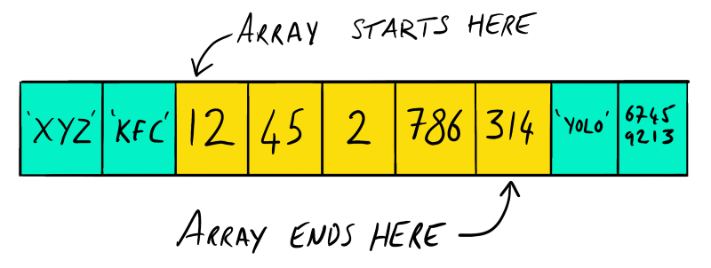
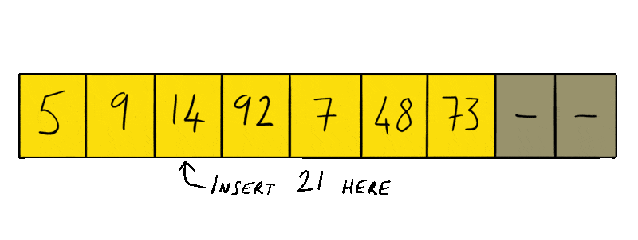

## Before We Start
At the beginning of the year I decided to improve my knowledge of programming and computer science concepts and one of the things I have always wanted to improve my knowledge of is data structures. As part of this series of posts I'm going to study them more in depth and try to learn their advantages, disadvantages, when to use them and their implementations.

These notes are aimed at myself as a way of documenting what I have learned and so may contain some incoherent babbling or simplificattions, however, if anyone else finds these notes useful then that is a definite bonus!

## Arrays

Before learning about more advanced data structures we should first understand a bit about arrays, how they work and their limitations.

## How They Work

Arrays are a collection of data. The data items in an array are held sequentially in memory. That means that the next data item (or pointer to it) in an array is stored in the very next 'slot' (register) in memory. The array `[12, 45, 2, 786, 314]` would look like this in memory:

This is why an array does not need keys for it's data items. The program knows where in memory the array starts and using a given index it can just count ahead that many memory slots to retreive the expected data.

**Javascript arrays are actually objects where each values' index is used as it's key. If we create a new array and specify it's length it doesn't actually reserve any space in memory, it simply creates an array object and sets the length property to the value it was given when created.**

## Disadvantages

As arrays store data sequentially in memory we need to know exactly how big our array will be when we create it so we can reserve enough slots in memory. This can be a big disadvantage as we don't always know how big our array will need to be beforehand and we may need to find large sections of contiguous free memory.

There are also problems when it comes to manipulating arrays. Inserting a value into an array can be slow. We need to find the first free memory slot in the array and work backwards copying each value into the previous slot in memory. Then once we reach the index where we would like to insert the new value we can place it in that memory slot (Demonstrated below). Likewise, removing a value would mean starting at the given index and copying the value of the next slot in memory to the previous slot until we reach the end of the array.

Lastly, finding if a value exists in an array can also be very slow. We need to iterate over each value in the array until we find the value we need. If an array contains 10,000 items and the value we are looking for is the last item of that array, that means iterating over the preceeding 9999 items before we get to the value we are looking for.

## Solutions
As you can see there are multiple problems with arrays as data structures. They are great if you have a set sequential data that you know the size of before hand but can be problematic for anything else. This is where data structures come in. Different data structures can solve different combinations of these problems. These data structures usually come with some trade off between CPU usage (time) and memory usage (space). I will be doing a write up about the most popular data structures, Linked Lists, Queues, Stacks, Heaps etc. First up will be Linked Lists.