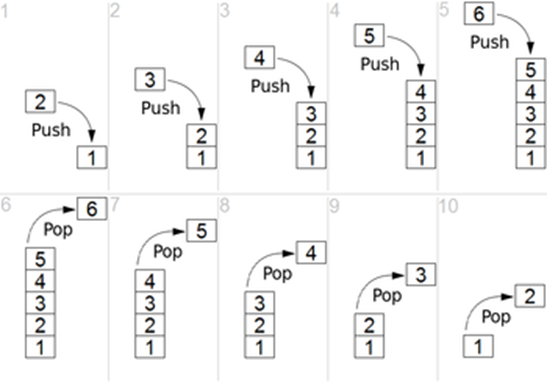

## What is a Stack?
A stack is a LIFO or "last in, first out" data structure that allows us to store and retreive data. A stack is much like a literal stack of boxes. We can only add a new box (our data) to the top of the pile (our stack) and remove a box from the top of the pile.



A stack is a linear data structure where each item in the stack only has a reference to the next item in the stack. A stack must be traversed in the order that data has been pushed to it.

Stacks are useful in lots of areas of development. They can be used in algorithms such as quicksorting, parsing strings to find values, converting a decimal number into binary and many other applications. Probably the most well known stack is the "call stack". This is used to maintain the order in which functions were called. Call stacks can be an invaluable tool when debugging as they show us the order of function calls and lead us to the point at which an error originated.

## Implementation
A stack can be built with an [Array](https://www.dantony.uk/data-arrays/) or a [Linked List](https://www.dantony.uk/data-linked-lists/). My example here is built upon my [Linked List](https://www.dantony.uk/data-linked-lists/) implentation. If you haven't read it already you may want to as it gives more context to what the linked list is doing under the hood.

In javascript an array is perfectly fine to use as the base of a stack. Arrays in javascript can grow or shrink dynamically meaning our stack is only limited by the amount of memory available. In a language such as Java or C# though, a linked list may be preferred so the stack can grow or shrink as needed.

If a stack has reached its max size and we try to add a further value to it, it will throw a "stack overflow" error. A stack only has a couple of methods or operations.

- Add - Allows us to add to the top of the stack
- Pop - Removes and returns the value at the top of the stack
- Peek - Returns the value at the top of the stack without removing it

Below is an example implementation of a stack in Typescript:

```typescript
import {LinkedList} from './LinkedList';

export class Stack<StackType> {
    private list: LinkedList<StackType>;


    constructor() {
        this.list = new LinkedList<StackType>();
    }


    public push(value: StackType): void {
        this.list.addToHead(value);
    }


    public pop(): StackType {
        return this.list.removeHead();
    }


    public peek(): StackType {
        return this.list.getTail();
    }


    public getSize(): number {
        return this.list.getSize();
    }
}

```

You can see the full source code [here](https://github.com/de86/datastructures/blob/master/src/Stack.ts).