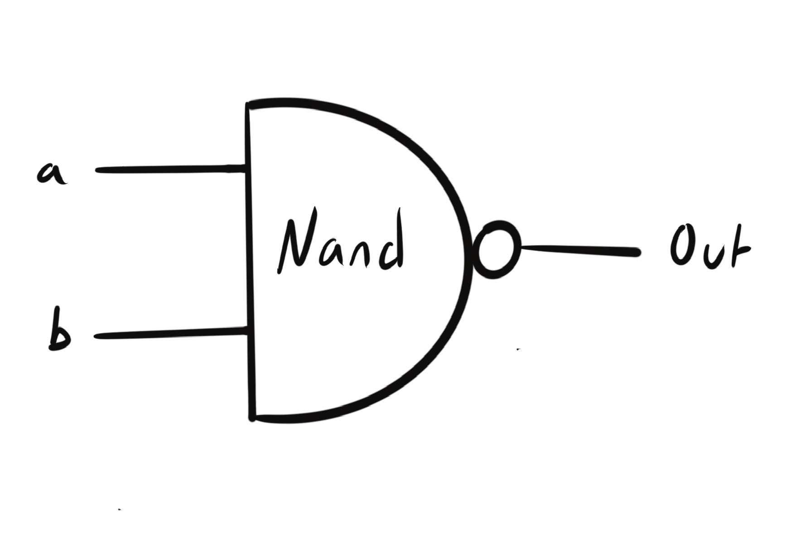
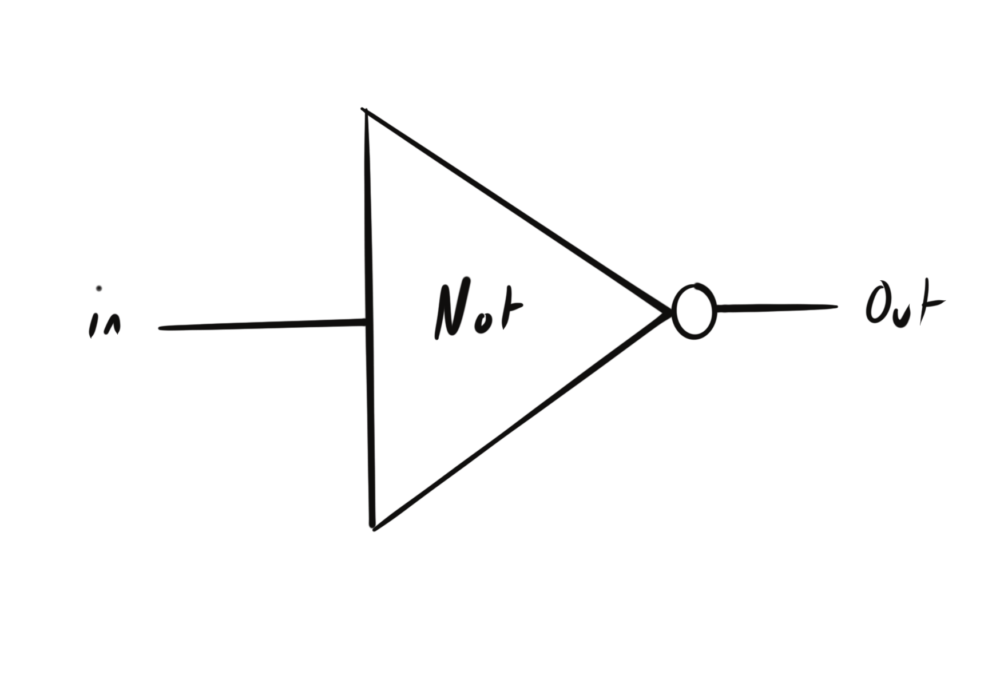
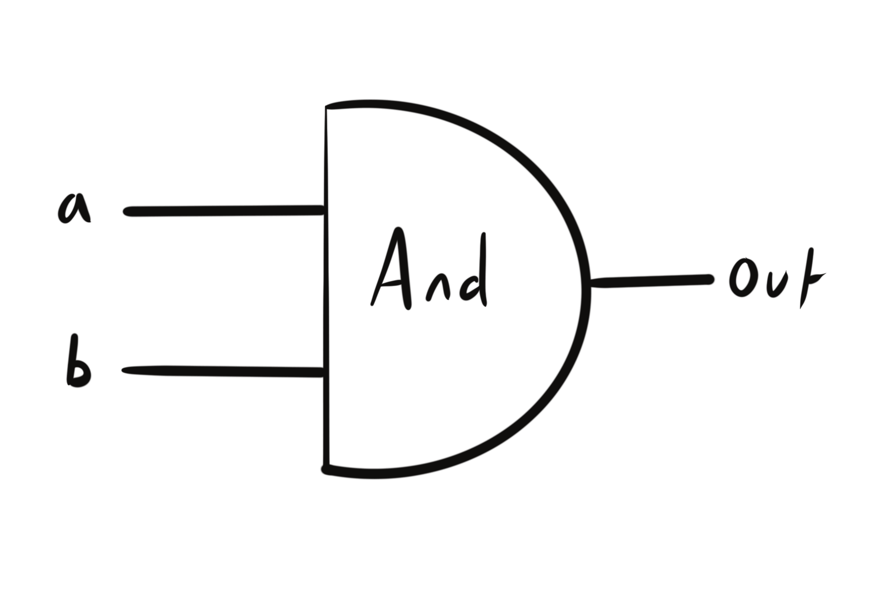
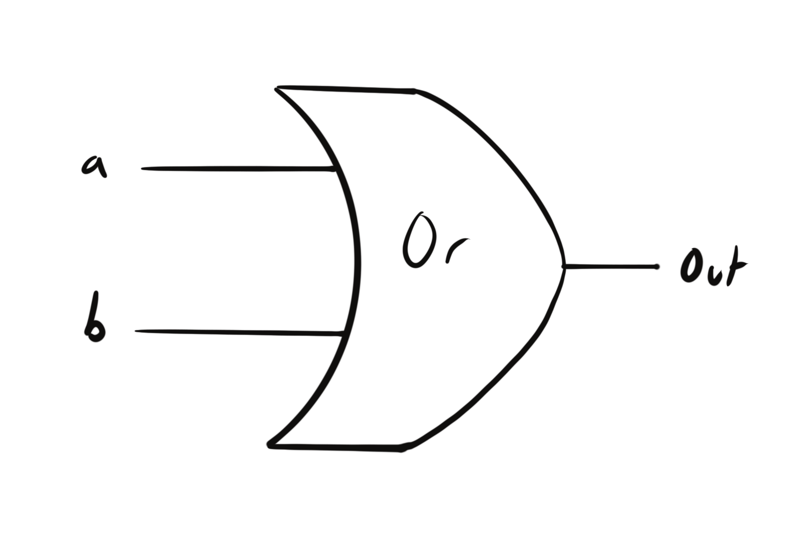
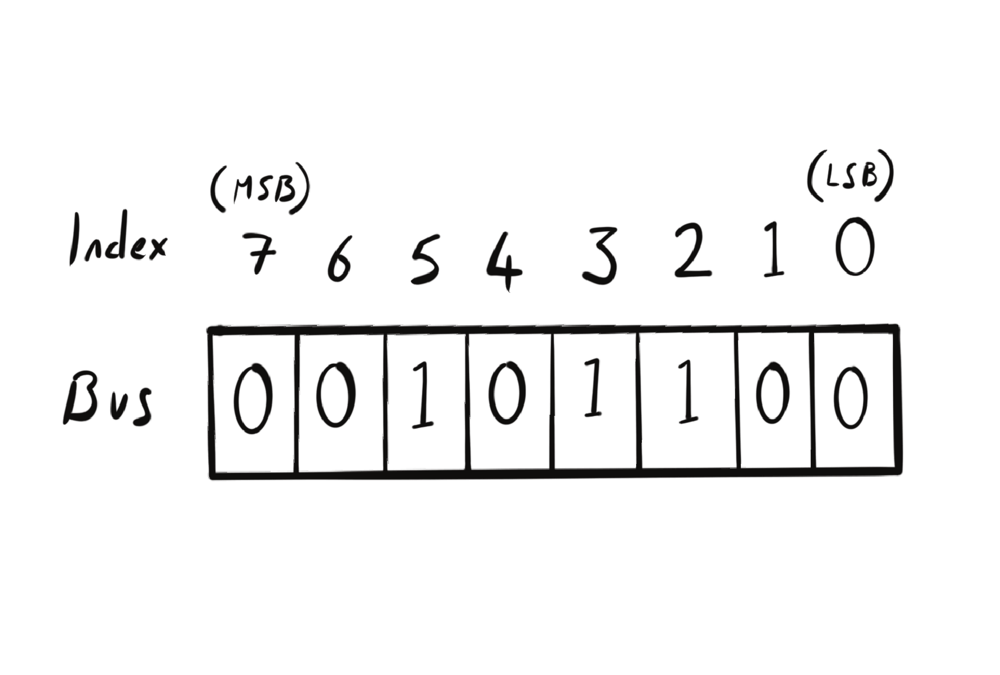
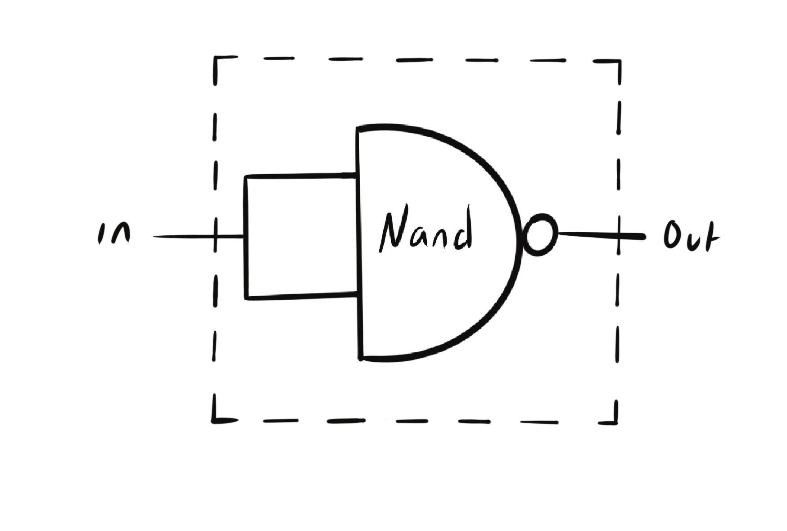
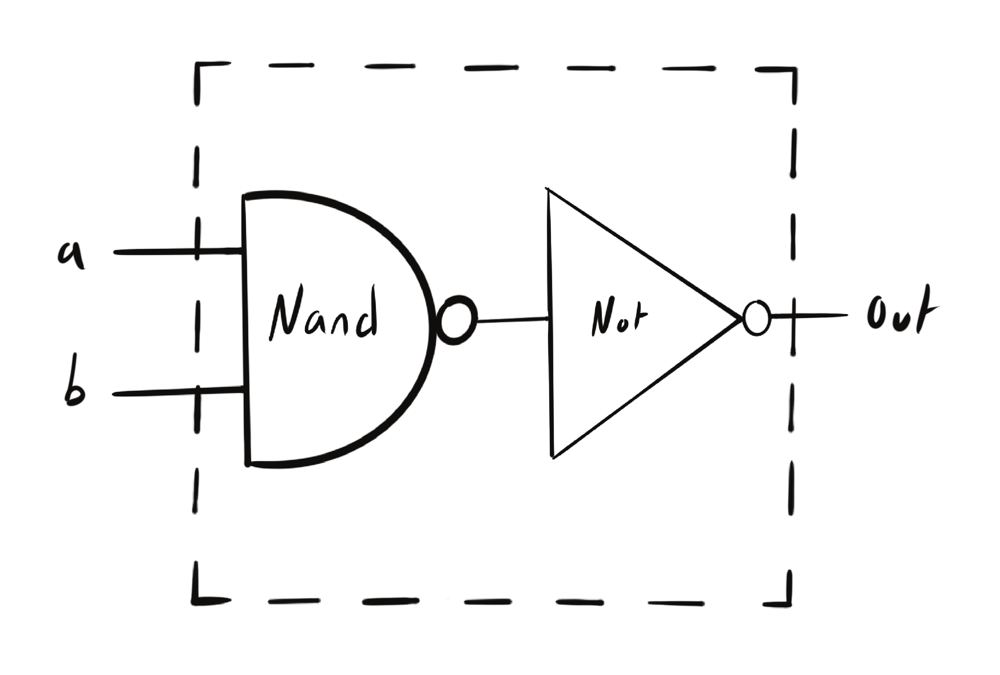

## Introduction

Welcome to part 2 of my week 1 write-up of the [Nand2Tetris](https://www.nand2tetris.org/) course. In this post I will be talking about Logic Gates, HDL and the implementation of a couple of logic gates. This part of the write-up relies on some knowledge form [part 1](https://www.dantony.uk/nand2Tetris-week-1/). If you haven't already, I'd recommend reading it [here](https://www.dantony.uk/nand2Tetris-week-1/).

## Logic Gates

A Logic Gate is one of the fundamental building blocks for all computers. They are also referred to as "chips" and these terms are often used interchangeably. These chips are found in all digital systems from motherboards, graphics cards and consoles to mobile phones Furbies and Tamagotchi's. These chips are the hardware that deal with the raw 1s and 0s of computer data.

*image of a chip here*

Logic gates allow us to implement, in hardware, the boolean operations and functions we discussed in [part 1](https://www.dantony.uk/nand2Tetris-week-1/). Logic gates take inputs as 1s or 0s, perform some boolean operations on these inputs and then give us an output.

NAND is the most elementary logic gate and from this we can create other basic logic gates like AND, OR and XOR. These logic gates can then be combined to create more complex logic gates such as AND16, OR16, MUX, DMUX and others. We can then combine them further to create an ALU (Arithmetic Logic Unit) that allows us to perform mathematical calculations. Then we can utilize the ALU to create a CPU (Central Processing Unit).

Logic gates can be described using diagrams, truth tables or with a functional specification. We will take a look at some of these below.

## The NAND Gate

In this course we get the given the NAND gate for free as all other gates can be created from this single gate.

The NAND gate should return a 0 when both inputs are 1, otherwise it should return a 1.

<br />

#### NAND Diagram



<br />

#### NAND truth Table

|a|b|out|
|--|--|--|
|0|0|1|
|0|1|1|
|1|0|1|
|1|1|0|

<br />

#### NAND Functional Specification

```
if (a==1 and b==1)
  then out=0
  else out=1
```

## The NOT Gate

The NOT gate can be created from just a single NAND gate.

The NOT gate should return a 1 when the input is 0 and a 0 when the input is 1.

<br />

#### NOT Diagram



<br />

#### NOT Truth Table

|in|out|
|--|--|--|
|0|1|
|1|0|

<br />

#### NOT Functional Specification

````
if (in==0)
  then out=1
  else out=0
````

## The AND gate

The AND gate can be created by combining our NAND and NOT gates together.

The AND gate should return a 1 when both inputs are 1 and 0 in any other case.

<br />

#### AND Diagram



<br />

#### AND Truth Table

|a|b|out|
|--|--|--|
|0|0|0|
|0|1|0|
|1|0|0|
|1|1|1|

<br />

#### AND Functional Specification

```
if (a==1 and b==1)
  then out=1
  else out=0
```

<br />

#### OR Diagram



<br />

#### OR Truth Table

|a|b|out|
|--|--|--|
|0|0|0|
|0|1|1|
|1|0|1|
|1|1|1|

<br />

#### OR Functional Specification

```
if (a==1 or b==1)
  then out=1
  else out=0
```

## Hardware Description Language (HDL)

In the real world logic gates are tiny pieces of hardware known as chips. They have current running through them that is interpreted as 1s and 0s. These chips are built by some very intelligent people known as electrical engineers using specialist equipment. Thankfully it's not important for us to physically build these chips ourselves. We simply need to understand the logic behind these chips and their role in digital systems.

We can implement these logic gates in a language known as HDL and emulate the chips behaviour in software. This effectively allows us to build a computer *inside* a computer. Very "Inner Space". There are a few different hardware description languages such as SystemVerilog or VHDL. These are used by professionals and are extremely robust and flexible.

HDL is not a programming language like C# or Python. HDL is a language that allows us to *describe* what the inside of a logic gate, or chip, does. One way of thinking about it is this: It allows us to describe the logic gate diagrams we have seen above in code.

The HDL we are using for this course is one that has been custom written by the course instructors to be simple enough for us to pick up quickly but still comprehensive enough for us to implement logic gates and build an ALU and CPU. Here is an example of the HDL we will use:

```
CHIP And {
    IN a, b;
    OUT out;

    PARTS:
    Nand (a=a, b=b, out=NotaAndb);
    Not (in=NotaAndb, out=out);
}
```

<br />

Lets break this down line by line:

```
CHIP And {
```

This is the chip declaration where we name our chip and begin the implementation.

<br />

```
IN a, b;
OUT out;
```

This is where we define our inputs and outputs. In this example our chip defines two inputs. a and b. We also have one output named out. Think of a and b as parameters in a function and out as a pre-defined return value name. The value assigned to out in our implementation is what the chip will return.

<br />

```
PARTS:
  Nand (a=a, b=b, out=NotaAndb);
  Not (in=NotaAndb, out=out);
```

This is the meat and veg of our... err... chips? We declare a PARTS: section where we define the logic of our chip. We can use other chips that we have already create, pass inputs to them and name their outputs. Just like we are doing with our chip. We can then use these named outputs as inputs into other chips.

In the example above we have our AND gates inputs, a and b. We are passing those inputs into a NAND logic gate, whose inputs are also named a and b. We have named the output from this chip NotaAndb. Next we pass NotaAndb into a NOT gate. Lastly we are assigning the output of this NOT gate to the output of our AND gate. The above implementation is describing an AND gate that looks like the diagram below.

If the above is somewhat confusing it may help to think of logic gates just like functions. The main difference being we name the functions output as the last parameter rather than assign the return value to a variable. We can then use that named output as input into other function calls (logic gates).

## Multi-Bit Busses

In the example above our logic gate took to two inputs, a and b. Each input was a single bit. A 1 or a 0. Multi-bit busses allow us to accept multiple bits through each input. Busses can be thought of as arrays of bits. We can access values in the busses using bracket notation just like arrays.

There is one difference though, values are accessed in reverse. the 0th indexed bit of the bus is actually the last bit in bus. If we think of this multi-bit bus of bits as a binary number then this means that bits are accessed in order of their significance. Index 0 is the least significant bit (the last bit in the bus) and the bit at the highest index is the most significant bit (the first bit of the bus). For example, if we have a 2 bit bus named 'in' of the value 01 then in[0] will return 1 as that is the least significant bit of our binary number. in[1] would return 0.



Here is an example of how we would use this in HDL:

<br />

```
IN in[8];
```
Here we have declared our input as an 8 bit multi-bit bus. This means that an 8 digit binary number such as 00101101 can be taken as input.

<br />

```
Or(a=in[0], b=in[1], out=w);
```
Now we can access any bits from our multi-bit input using bracket notation just like an array. In the example above we have assigned the bit at index 1 of in to a and the bit at index 0 to b.

## Week 1 Project

The first weeks project work is to implement 15 different logic gates in HDL. I wont go over all of them here just the elementary gates NOT, AND and OR. This should give you a feel for the thought process I went through while building these gates.

## NOT Gate Implementation

The NOT gate is the first gate we must implement. It's function is to return a 1 when given an input of 0 and a 0 when given an input of 1. We can see it's truth table below.

<br />

#### NOT Truth Table

|in|out|
|--|--|
|0|1|
|1|0|

<br />

The only other gate available to us right now is the NAND gate so lets take a look at that truth table.

<br />

#### NAND Truth Table

|a|b|out|
|--|--|--|
|0|0|1|
|0|1|1|
|1|0|1|
|1|1|0|

<br />

As you can see from the truth table above our NAND gate requires two inputs, however, the NOT gate we are building only takes one input. That input can only be a 1 or a 0. This means we only have a single input to give to our NAND gate.

Looking again at the NAND truth table above if we provide it with two 0s as input we get a 1 and if we provide it with two 1s we get a 0. That's exactly what we want from our NOT gate. We can achieve this behaviour by passing our single input to both inputs of the NAND gate. Diagram and HDL solution below.

### Solution Diagram



### HDL Implementation

```
CHIP Not {
    IN in;
    OUT out;

    PARTS:
    Nand (a=in, b=in, out=out);
}
```

## AND Gate Implementation

Next on the list is the AND gate. It should take two inputs and return a 1 only when both inputs are a 1. Otherwise it should be a 0. Here is it's truth table.

<br />

#### AND Truth Table

|a|b|out|
|--|--|--|
|0|0|0|
|0|1|0|
|1|0|0|
|1|1|1|

<br />

As we know a NAND gate is the opposite of an AND gate. It returns 0 when both inputs are 1 otherwise it returns a 1. We also now have a NOT gate that can flip values. We can take both of our inputs and feed them into a NAND gate. We can then use that NANDs output and invert it by running it through a NOT gate. This will give us the inverse of a NAND gate. Diagram and HDL solution below.

### Solution Diagram



### HDL Implementation

```
CHIP And {
    IN a, b;
    OUT out;

    PARTS:
    Nand (a=a, b=b, out=NotaAndb);
    Not (in=NotaAndb, out=out);
}
```

## OR Gate Implementation

The OR gate should take two inputs and return a 1 if either of the the inputs is a 1, otherwise it should return a 0. Truth table below:

<br />

#### OR Truth Table

|a|b|out|
|--|--|--|
|0|0|0|
|0|1|1|
|1|0|1|
|1|1|1|

As you can see this is actually quite close to our NAND table, except that the outputs for two 0s and two 1s is inverted. We can achieve this by running our two input values through the NOT gate we create above. This will invert our initial input values. We can then pass them through a NAND gate. This will give us the effect returning a 1 when both input values are 1 as opposed to a 0. Diagram and HDL solution below.

### Solution Diagram


### HDL Implementation

```
CHIP Or {
    IN a, b;
    OUT out;

    PARTS:
    Not(in=a, out=Nota);
    Not(in=b, out=Notb);
    Nand(a=Nota, b=Notb, out=out);
}
```

## Conclusion

The gates above are the simplest gates to explain and implement. The logical complexity of each of the 15 gates increases as we work through them, however, the implementation of the gates can remain simple as we can just re-use previously built gates.

We can also see that it is entirely possible to build everything with simple NAND gates. By building these gates we are abstracting different logical functions into their own gates and then building on top of those to create more complex gates. It is entirely possible to build everything that a computer needs just with NAND gates alone.

The gates we looked at above were just 3 of the 15 gates in this weeks assignement. If you would like to view the implementations of all 15 gates you can do [here](https://github.com/de86/nand2tetris/tree/master/week1-hdl).