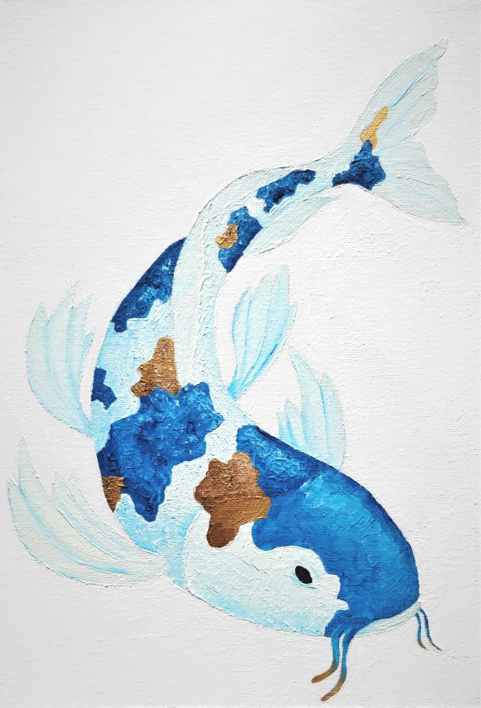

When I was young and in school I used to love to draw and paint. Along with football and playing on my SNES (Way better than the Mega-Drive by the way) it was on of the main things I would do with my time. I would copy pictures of characters from the games I loved to play, make up my own characters and draw landscapes, pictures of the houses on my street. I once drew the back of my neighbours work van just because he had some sort of rack attached to the back of it and it looked complex.

As I grew up though I drew less and less. I think I lost the the patience to sit down and practice, the other arty kids started to become better than me and I was becoming more interested in playing football and so I eventually lost interest.

Recently though, I have been watching lots of artists on youtube and remembering my fondness for art in general and so I decided to have a crack at picking up a paint brush again now I have had time over the Christmas holidays. 

For some reason I have always enjoyed koi carp paintings. I think because of the combination of simplicity and bright colours so below is the painting of a koi carp I conjured up. Considering the amount of time since I tried to paint something properly, it's not terrible. (Sorry for the potato quality. it's on a canvas so i can't scan it).

