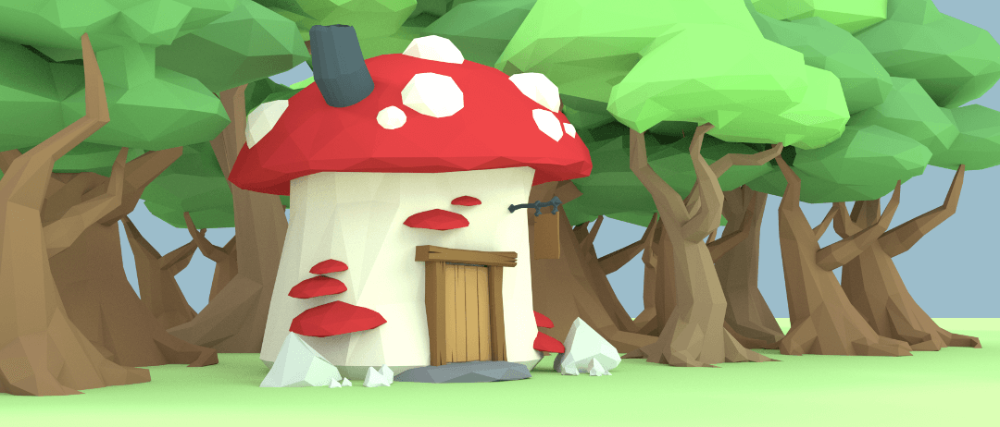
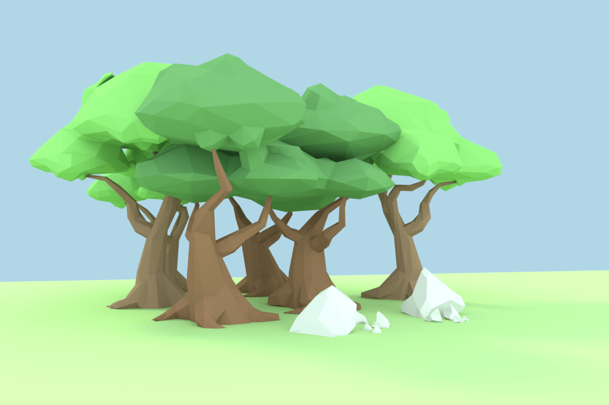
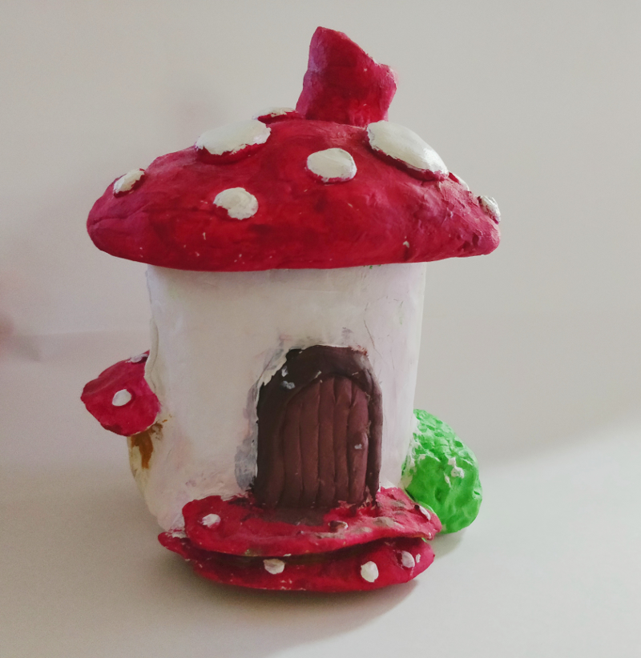

One of my favourite visual styles is low-poly 3D with Flat colours and ambient occlusion. That's the look I will be going for in Ymir. For me low-poly is the pixel-art equivalent of 3D. When done well it has as beautiful, whimsical aesthetic that lends itself well to fantasy worlds. It's relatively quick and easy to make low-poly models using just the basic modelling tools in Blender and hopefully it will mean my game wont require a powerhouse graphics card to run.

In previous game prototypes that I have cobbled together one of the things that always de-motivated me was a lack of good assets. I'm quite a visual person so making games with squares, circles and triangles knocked together in paint or using low-quality sprites from sites like open game art left me feeling uninspired. Despite getting the base game mechanics of a prototype working it never felt like the game I wanted to make. That's largely because, to me, a big part of a games appeal is it's visuals.

To pre-empt this I am creating some semi-placeholder assets in blender. I don't expect these assets to be used as-is in the final game (If I get to that point), however, creating these gives me something to work with that is close to my vision for the game. This will also give me some base assets that I can refine and modify later in development and hopefully save some time in creating final assets.

So here it is, my first piece of "concept art" made from my placeholder game assets. My lighting skills in Blender aren't great yet but that will come in time with some practice. Hopefully this will give you a good idea of the aesthetic I'm going for in my game.

This is an image of a small store that could be found in the forest. I'm imagining the owner of this store to be an old, battle weary fairy covered in scars who has retired from adventuring and now supports his/herself by selling wares to other adventurers.

In stores like this you would be able to buy supplies such as potions and items to help you on your journey. The store owners may offer bounty missions, side quests or hints to the location of nearby dungeons or treasure chests.

As a side note: The inspiration for the mushroom shop came from this clay model my niece created below.

