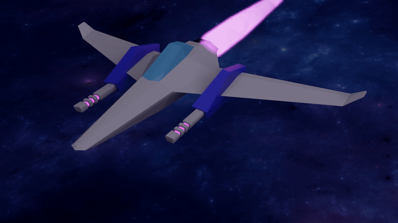

## Introducing Star Runner

I have a period of a few weeks off or Christmas this year and I have a goal to develop and release a game during that time. Game dev is a long term goal of mine and so taking this free time to get something published, no matter how small the scope, is a good first step.

Star Fox was one of my favourite SNES games back in the day and I have often wanted to make a Star Fox clone of my own. I don't know of any modern day rails shooters like it. Creating a full on clone would be way too much work to do in 3 weeks so I'm going to keep the scope much smaller. It will be an "endless-runner" style game where the objective is to stay alive as long as possible, shooting enemies and avoiding environmental obstacles. That's it really, no multiple levels, no customization, no bosses, maybe a leaderboard if there is time, though that may come later.

In preparation for getting started I have created my first in-game asset. The players ship. Here is a render of it. Wish me luck!

